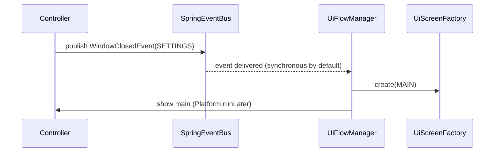

## UI wrapper: UiScreen, UiScreenFactory and UiFlowManager

This document explains the JavaFX UI wrapper used in the project: how screens are modeled, how controllers exchange data with screens, how to open/close screens from anywhere in the app and how the central `UiFlowManager` coordinates navigation.

### Goals

- Provide a small, uniform API to open/close screens from application code:
  UiScreen main = screenFactory.create(UiScreenId.MAIN); main.show();
- Support two kinds of screens:
  - Primary screens (`UiPrimaryScreen`) — replace or drive the main Scene/Stage
  - Modal screens (`UiModalScreen`) — transient windows/dialogs that return control to the caller
- Give a simple way to pass data between controller and caller (`UiControllerDataAware<T>`)
- Centralize cross-screen navigation rules in `UiFlowManager`

---

## Concepts and API

### UiScreen (core interface)

`UiScreen` is the small abstraction representing a view. Important methods:

- `UiScreenId id()` — unique id for the screen
- `Stage stage()` / `Scene scene()` — advanced accessors
- `void show()` / `void hide()` — change the visible state
- `void showAtPosition(Point p)` — place modal windows
- `boolean isShowing()` — visibility check
- `UiScreenController controller()` — access the controller instance
- `default <T> void setData(T data)` — helper that forwards data to controllers that implement `UiControllerDataAware<T>`

This gives a single place to open screens and set initial data.

### UiPrimaryScreen vs UiModalScreen

- `UiPrimaryScreen` implementations manipulate the main Scene/Stage. Use when switching the main content of the application.
- `UiModalScreen` implementations are used for transient dialogs/panels that should not replace the main content (e.g. New Task dialog). They typically create a new Stage or overlay and expose `showAtPosition(...)`.

### UiControllerDataAware<T>

Controllers that need to receive or expose data implement `UiControllerDataAware<T>`. The `UiScreen.setData(...)` default method checks whether the controller implements that interface and calls `setData`.

Example:

```java
UiScreen newTask = screenFactory.create(UiScreenId.NEW_TASK_DIALOG);
newTask.setData(new NewTaskPanelData("Creating a new operation?"));
newTask.showAtPosition(new Point(120, 110));
```

### UiScreenFactory

`UiScreenFactory` is responsible for creating `UiScreen` instances (primary or modal) given a `UiScreenId`. The factory may require the JavaFX `Stage` to create primary screens; in this project the `TaskerApplication` registers the primary Stage in the Spring context before obtaining the factory.

Typical usage:

```java
UiScreen main = screenFactory.create(UiScreenId.MAIN);
main.show();
```

### Events (WindowEvent hierarchy)

The UI layer emits generic window events to decouple controllers from navigation logic. There are two concrete events:

- `WindowOpenedEvent(UiScreenId)`
- `WindowClosedEvent(UiScreenId)`

These are simple POJOs used with Spring's event system (published through `ApplicationEventPublisher`).

Example publish on close (in a controller):

```java
eventPublisher.publishEvent(new WindowClosedEvent(UiScreenId.SETTINGS));
```

Listeners are standard Spring beans annotated with `@EventListener`.

---

## UiFlowManager — central navigation rules

`UiFlowManager` is a Spring-managed component (single responsibility) that:

- Listens for `WindowOpenedEvent` / `WindowClosedEvent`
- Applies application-level navigation rules (for example: when SETTINGS closes, show MAIN)
- Uses `UiScreenFactory` to open/close screens; keeps UI rules out of controllers

Key properties:

- Implemented as a regular Spring bean, lazily created in this project to avoid startup ordering issues with JavaFX `Stage` injection
- Uses `Platform.runLater(...)` to ensure UI operations run on the JavaFX Application Thread

Example behavior (current rules):

- When `WindowClosedEvent(SETTINGS)` is received -> create/show `UiScreenId.MAIN`
- When `WindowOpenedEvent(NEW_TASK_DIALOG)` is received -> create `NEW_TASK_DIALOG`, set data, show at a fixed position

See the mermaid flow diagrams below for the visual flow.

---

## Flow diagrams (Mermaid)

Main flow: open settings -> close settings -> back to main

```mermaid
flowchart LR
    MAIN[Main Screen]
    SETTINGS[Settings]
    MAIN -->|open settings| SETTINGS
    SETTINGS -->|close (WindowClosedEvent)
    MAIN
```

New task dialog flow (modal)

```mermaid
flowchart TB
    MAIN[Main Screen]
    NEW[New Task Dialog]
    MAIN -->|open new task dialog| NEW
    NEW -->|close (no main switch)| MAIN
```

Combined sequence showing event-driven handoff



Notes:
- By default Spring publishes events synchronously. `UiFlowManager` uses `Platform.runLater` to invoke UI actions safely on the JavaFX thread.
- If you enable async (`@EnableAsync` + `@Async`), listeners will run on a different thread and must use `Platform.runLater` for UI updates.

---

## Practical tips and gotchas

- JavaFX `Stage` must be registered in the Spring context before creating screen beans that require it. In this project `TaskerApplication.start(...)` registers the primary Stage then obtains the `UiScreenFactory`.
- Prefer lazy injection or `ObjectProvider<UiScreenFactory>` for components created before the Stage is registered.
- Keep controllers thin: they should publish window events and react to user input; navigation rules belong to `UiFlowManager`.
- Use `UiControllerDataAware<T>` and `UiScreen.setData(...)` to pass initial data into controllers; prefer immutable data DTOs.

---

If you need more diagrams (detailed sequence for a specific screen) or a class diagram, tell me which view/controller to document next.
